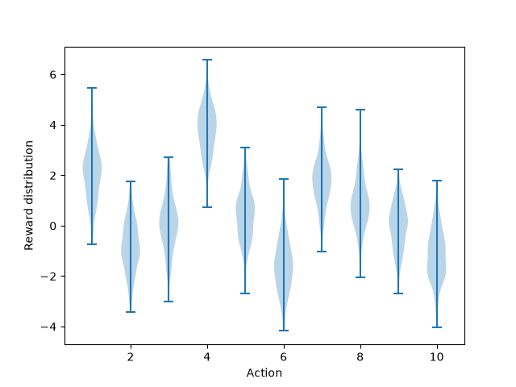
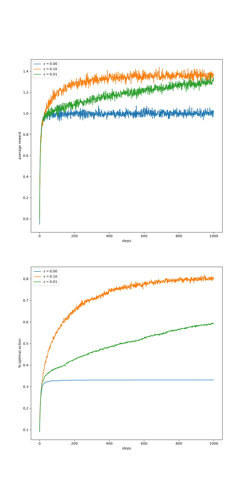

# Chapter 2：Multi-Armed Bandit

## 学习目标

- 理解 action value 如何由采样 reward 逐步估计。
- 理解 epsilon-greedy 如何在探索和利用之间取舍。
- 比较不同 epsilon 对平均 reward 和最优动作比例的影响。
- 能从图表中提出结论，而不只是成功运行代码。

## 本次代码来源

- 上游仓库：[ShangtongZhang/reinforcement-learning-an-introduction](https://github.com/ShangtongZhang/reinforcement-learning-an-introduction)
- 主要脚本：`chapter02/ten_armed_testbed.py`
- 当前进度：已运行 Figure 2.1-2.6，下一步是完成自己的 epsilon 参数实验。

## 图表分类

### 主线必看

| 图表 | 回答的问题 |
|---|---|
| Figure 2.1 | 10 个动作的 reward 分布是什么样？ |
| Figure 2.2 | epsilon 为 0、0.01、0.1 时，平均 reward 和最优动作比例如何变化？ |





### 扩展理解

| 图表 | 主题 | 第一轮要求 |
|---|---|---|
| Figure 2.3 | Optimistic Initial Values | 理解初始估计也能鼓励探索 |
| Figure 2.4 | UCB | 知道它会优先尝试不确定性较高的动作 |
| Figure 2.5 | Gradient Bandit | 知道 baseline 能降低更新波动 |
| Figure 2.6 | Parameter Study | 观察算法对参数的敏感性 |

详细说明见 [图表导读](figures-guide.md)。

## 下一次实验

固定随机种子、runs 和 time steps，只修改 epsilon。建议先比较：

```text
epsilon = 0
epsilon = 0.01
epsilon = 0.1
epsilon = 0.3
```

需要保存：

- 平均 reward 曲线。
- 最优动作比例曲线。
- 完整参数表。
- 对前期、后期表现差异的解释。

完成后用 [实验记录模板](../../templates/experiment-note.md) 新建 `bandit-experiment.md`。

## 与六足机器人的联系

六足机器人训练初期并不知道哪些动作或步态更有效。如果探索不足，策略可能过早停在一个“能走但不够好”的行为上；探索过强，又会降低训练效率并产生大量不稳定动作。Bandit 把这个矛盾简化到了最容易观察的形式。
