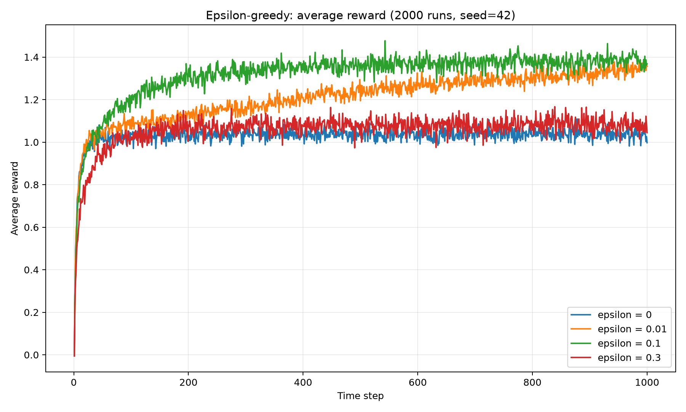
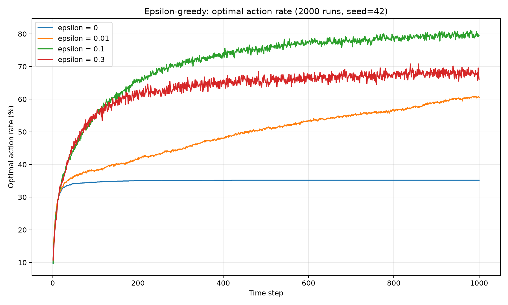

# Epsilon-Greedy 参数对比实验

## 1. 实验信息

| 项目 | 内容 |
| --- | --- |
| 日期 | 2026-07-13 |
| 学习来源 | Sutton & Barto Chapter 2；Shangtong Zhang 的 10-armed testbed |
| 实验脚本 | [`epsilon_experiment.py`](epsilon_experiment.py) |
| 运行环境 | Python；NumPy；Matplotlib |
| 实验状态 | 已完成正式运行与结果分析 |

## 2. 实验目标

在其他条件保持不变时，只修改 epsilon，比较 `0`、`0.01`、`0.1`、`0.3` 对平均 reward 和最优动作比例的影响。

## 3. 我的实验前假设

- `epsilon = 0` 完全利用当前估计，前期不一定最差，但可能过早锁定错误动作。
- `epsilon = 0.01` 探索较少，后期应比纯贪心稳定，但找到最优动作较慢。
- `epsilon = 0.1` 应在探索和利用之间取得较好的长期平衡。
- `epsilon = 0.3` 探索很强，能较快发现好动作，但后期仍有 30% 概率随机选择，平均 reward 可能受损。

## 4. 环境与概念映射

| 概念 | 本实验中的含义 |
| --- |---|
| State | Bandit 没有随时间变化的环境状态，可视为始终处于同一个状态 |
| Action | 从 10 个拉杆中选择一个 |
| Reward | 从所选动作对应的正态分布中采样的数值 |
| Policy | epsilon-greedy 动作选择规则 |
| Q value | 对每个动作期望 reward 的样本平均估计 |

## 5. 实验设计

### 完整参数表

运行后查看 [`results/parameters.csv`](results/parameters.csv)。核心参数如下：

| 参数 | 数值 | 是否变化 |
|---|---:|:---:|
| random seed | 42 | 否 |
| runs | 2000 | 否 |
| time steps | 1000 | 否 |
| k arms | 10 | 否 |
| Q 更新方法 | sample average | 否 |
| epsilon | 0、0.01、0.1、0.3 | 是 |

四种策略共享同一批 `q_true` 测试环境，使主要差异来自 epsilon。

## 6. 运行方法

在仓库根目录执行：

```powershell
.\.venv\Scripts\python.exe .\stage-01-tabular-rl\chapter-02-bandit\epsilon_experiment.py
```

快速检查脚本时，可以减少规模：

```powershell
.\.venv\Scripts\python.exe .\stage-01-tabular-rl\chapter-02-bandit\epsilon_experiment.py --runs 100 --steps 200
```

正式结果必须重新使用默认的 `runs=2000`、`steps=1000`。

## 7. 实验结果

### 平均 reward

运行后将在下方显示：



### 最优动作比例



数值汇总见 [`results/summary.csv`](results/summary.csv)。

### 前期与后期汇总

| epsilon | 前 100 步平均 reward | 后 100 步平均 reward | 前 100 步最优动作率 | 后 100 步最优动作率 |
|---:|---:|---:|---:|---:|
| 0 | 0.9616 | 1.0343 | 32.38% | 35.20% |
| 0.01 | 0.9933 | 1.3375 | 34.40% | 60.01% |
| 0.1 | **1.0219** | **1.3848** | 42.38% | **79.63%** |
| 0.3 | 0.8810 | 1.0795 | **42.86%** | 67.92% |

## 8. 结果分析

1. 前 100 步中，`epsilon = 0.1` 的平均 reward 最高，为 1.0219。`epsilon = 0.3` 的前期最优动作率略高，但平均 reward 最低，说明强探索虽然更容易碰到最优动作，也会频繁选择较差动作。
2. 后 100 步中，`epsilon = 0.1` 的平均 reward 最高，为 1.3848；最优动作率也最高，约为 79.63%。在本实验范围内，它取得了最好的探索与利用平衡。
3. `epsilon = 0.3` 与 `epsilon = 0.1` 的最优动作率前期上升最快。约 150 步之后，`epsilon = 0.1` 继续超过 `epsilon = 0.3`，因为它在发现好动作后更常利用该动作。
4. `epsilon = 0` 只利用当前估计。早期 reward 噪声可能让它误判某个普通动作为最好动作，之后没有主动探索机制来修正这个错误，所以最优动作率很快停在约 35% 的平台。
5. `epsilon = 0.3` 即使已经识别出好动作，每一步仍有 30% 概率随机探索。随机动作中大多数不是最优动作，因此后期 reward 和最优动作率都受到上限约束。
6. 结果支持实验前假设：完全不探索会过早收敛，探索过强会长期支付即时 reward 成本，中等 epsilon 在 1000 步内表现最好。

## 9. 与六足机器人的联系

在六足机器人训练中，epsilon 可以类比为动作探索强度。探索不足时，机器人可能停留在“能走但效率低或不稳定”的局部策略；探索过强时，已经学会较好步态后仍会频繁尝试随机动作，造成摔倒、能耗增加和训练效率下降。

Bandit 省略了机器人中的状态变化和连续动作，但清楚展示了同一个核心矛盾：探索有助于发现长期更好的行为，同时也会付出即时 reward 的代价。

## 10. 本次结论

epsilon-greedy 的效果不是 epsilon 越大越好或越小越好，而是探索收益与探索成本的平衡。本实验中，纯贪心策略因为无法修正早期误判，后期最优动作率只有约 35.20%；`epsilon = 0.3` 能较快发现好动作，却因持续强探索损失 reward。`epsilon = 0.1` 在前 100 步和后 100 步都取得最高平均 reward，并在后期达到约 79.63% 的最优动作率，因此是这组参数和 1000 步时域下的推荐值。这个推荐不是普遍常数，任务长度、动作数量和 reward 噪声变化后仍需重新实验。

## 11. 下一步

- [x] 根据正式结果填写第 8、10 节。
- [ ] 用另一个随机种子重复实验，检查结论是否稳定。
- [ ] 进入 Chapter 4 GridWorld 与 value iteration。
